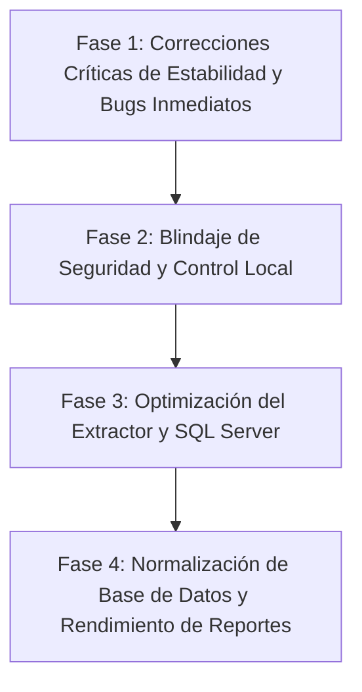

# REPORTE DE AUDITORÍA TÉCNICA: RESTAURANT AGENT

> **Fecha del reporte:** 13 de Septiembre de 2026  
> **Alcance del análisis:** Inspección integral de código fuente de `central-api`, `extractor`, `extractor-ui`, `sync-contracts`, `installer`, `dashboard-web`, `admin-web`, esquemas SQL (PostgreSQL/SQL Server) y configuración de despliegue Docker.  
> **Objetivo:** Detección de errores funcionales (bugs), vulnerabilidades de seguridad, deuda técnica y propuesta de corrección en fases simples y funcionales.

---

## RESUMEN EJECUTIVO DE HALLAZGOS

| Severidad | Errores Funcionales (Bugs) | Vulnerabilidades de Seguridad | Deuda Técnica y Rendimiento | Total |
| :--- | :---: | :---: | :---: | :---: |
| **Crítica (P0)** | 4 | 2 | 2 | **8** |
| **Alta (P1)** | 2 | 3 | 3 | **8** |
| **Media (P2)** | 3 | 2 | 4 | **9** |
| **Total** | **9** | **7** | **9** | **25** |

---

## 1. ERRORES CRÍTICOS Y FALLOS FUNCIONALES (BUGS)

### 1.1 Colapso del extractor por colisión en `SalePayment.IdempotencyKey`
- **Ubicación:** `sync-contracts/Contracts.cs` (Líneas 180-183) y `extractor/ExtractionJob.cs` (Línea 59)
- **El Fallo:**
  ```csharp
  // Contracts.cs
  public string IdempotencyKey => !string.IsNullOrWhiteSpace(WorkspaceId)
      ? WorkspaceId!
      : $"{Folio}:{IdFormaDePago}:{Importe}:{Referencia}";
  ```
  Si un ticket en SoftRestaurant se liquida en dos o más exhibiciones con la misma forma de pago y el mismo importe (por ejemplo, dos billetes de $500 en efectivo, o dos vales idénticos sin referencia), ambas filas de pago producen exactamente la misma `IdempotencyKey`.
- **Impacto:** En `ExtractionJob.cs`, la función `EnsureUnique("pagos", ...)` lanza una excepción no controlada (`InvalidOperationException: Existen llaves duplicadas en pagos`). **El ciclo de sincronización del restaurante colapsa de inmediato y no vuelve a transmitir.**

### 1.2 Sobreescritura destructiva de Movimientos de Caja (`CashMovement`)
- **Ubicación:** `sync-contracts/Contracts.cs` (Línea 229) y `central-api/BatchIngestor.cs` (Líneas 470-492)
- **El Fallo:**
  ```csharp
  // Contracts.cs
  public string IdempotencyKey => Folio.ToString();
  ```
  En SoftRestaurant, el folio de caja (`movtoscaja.folio`) frecuentemente es un consecutivo periódico que se reinicia por turno, estación o año.
- **Impacto:** En PostgreSQL, la tabla `cash_movements` tiene como llave primaria `(branch_id, idempotency_key)`. Cuando se inserta un nuevo movimiento con un folio que ya existió en otro turno o fecha anterior, `ON CONFLICT (branch_id, idempotency_key) DO UPDATE` **sobreescribe y borra permanentemente el movimiento de caja histórico previo**.

### 1.3 Bloqueo del Plan UNLIMITED limitado a 5 sucursales
- **Ubicación:** `central-api/SubscriptionRegistry.cs` (Línea 36) y `central-api/WebApiEndpoints.cs` (Línea 176)
- **El Fallo:**
  ```csharp
  // SubscriptionRegistry.cs
  public static int GetBranchLimit(string plan) => plan == "BASIC" ? BasicBranchLimit : PlusBranchLimit;
  ```
- **Impacto:** Para el plan `"UNLIMITED"`, `GetBranchLimit` evalúa la condición ternaria y retorna `PlusBranchLimit` (valor fijo de **5**). El suscriptor que paga el plan más alto no puede registrar más de 5 sucursales; la API le rechaza la creación con un error HTTP 403.

### 1.4 Evasión del límite de sucursales por discrepancia Negocio vs Cuenta
- **Ubicación:** `central-api/WebApiEndpoints.cs` (Líneas 176-177) y `central-api/BusinessRegistry.cs` (Línea 77)
- **El Fallo:** La validación de límite de sucursales ejecuta:
  ```csharp
  if (await branches.CountBranchesAsync(businessId, ct) >= branchLimit)
  ```
  La cuenta tiene un límite de sucursales según su suscripción (ej. BASIC = 1), pero el conteo se evalúa **por `businessId`** y no por usuario/cuenta. Un usuario puede crear negocios ilimitados con `POST /api/web/businesses`.
- **Impacto:** Un usuario en prueba gratuita o plan BASIC (1 sucursal) puede crear múltiples negocios y registrar 1 sucursal en cada uno, obteniendo decenas de sucursales activas sin pagar planes superiores.

### 1.5 Lotes de sincronización rechazados por Nginx con HTTP 413 (Silent Failure)
- **Ubicación:** `dashboard-web/nginx.conf` (Líneas 19-27)
- **El Fallo:** En `central-api/Program.cs` Kestrel admite hasta 512 MB (`MaxRequestBodySize = 512L * 1024 * 1024`). Sin embargo, en `dashboard-web/nginx.conf` (que actúa como reverse proxy público para `/api/`) **no se define la directiva `client_max_body_size`**.
- **Impacto:** Nginx aplica su valor por defecto de **1 MB**. Cualquier lote histórico, ventana de recuperación o turno concurrido cuyo JSON supere 1 MB es abortado por Nginx con código `413 Request Entity Too Large`, sin llegar al backend. El agente reportará error de red y se quedará reintentando en bucle.

### 1.6 Despliegue Docker fallido por imagen inexistente `postgres:18-alpine`
- **Ubicación:** `docker-compose.yml` (Línea 3) y `docker-compose.coolify.yml` (Línea 3)
- **El Fallo:**
  ```yaml
  image: postgres:18-alpine
  ```
- **Impacto:** PostgreSQL 18 no existe actualmente (las versiones oficiales estables son 16 y 17). Al desplegar en un entorno nuevo o Coolify, Docker fallará al intentar descargar la imagen (`manifest for postgres:18-alpine not found`).

---

## 2. VULNERABILIDADES DE SEGURIDAD

### 2.1 Servidor de Control Local sin autenticación ni validación de Origin (CSRF Local)
- **Ubicación:** `extractor/AgentControlServer.cs` (Líneas 70-116)
- **Vulnerabilidad:** El servidor HTTP local escucha en `http://127.0.0.1:47811` y expone endpoints de mutación (`/unlink`, `/link`, `/sync-now`) sin token de autenticación local, sin validación de cabeceras `Origin` ni protección CSRF.
- **Riesgo:** Si un usuario o cajero navega por internet en la máquina donde corre el agente y visita un sitio web malicioso, un script JavaScript puede ejecutar:
  ```javascript
  fetch('http://127.0.0.1:47811/unlink', { method: 'POST' });
  ```
  Esto desconecta y desvincula el servicio Windows de la sucursal de manera remota e inadvertida.

### 2.2 Denegación de Servicio (DoS / Memory Exhaustion) en `POST /api/ingestion/batches`
- **Ubicación:** `central-api/Program.cs` (Líneas 9 y 486) y `central-api/BatchIngestor.cs` (Líneas 220-224)
- **Vulnerabilidad:** La API permite cuerpos de hasta 512 MB. Al recibir el lote, `context.Request.ReadFromJsonAsync<SyncBatch>()` lo deserializa en memoria. Luego, `BatchIngestor` vuelve a serializar los arrays a strings gigantes (`JsonSerializer.Serialize(values)`) y se los envía a PostgreSQL como parámetros de texto `$2::jsonb` para procesarlos con `jsonb_array_elements`.
- **Riesgo:** Peticiones grandes simultáneas pueden agotar la memoria RAM del contenedor .NET (`OutOfMemoryException`) y degradar los buffers de memoria de PostgreSQL.

### 2.3 Exposición de credenciales SQL maestras en el instalador compilado
- **Ubicación:** `installer/build-installer.ps1` (Líneas 77-78) y `installer/RestaurantAgent.iss` (Línea 75)
- **Vulnerabilidad:** Si durante la compilación del instalador se proporciona la variable `$env:SRX_INSTALLER_SQL_PASSWORD`, el script la inyecta como texto plano dentro del código Pascal de Inno Setup:
  ```pascal
  DefaultSqlPassword = '{#BuildSqlPassword}';
  ```
- **Riesgo:** El instalador `.exe` resultante contendrá la contraseña maestra de SQL Server en texto plano dentro de sus binarios. Cualquier usuario con acceso al instalador puede extraerla con utilidades de inspección de texto.

### 2.4 Cifrado DPAPI a nivel de máquina (`DataProtectionScope.LocalMachine`)
- **Ubicación:** `extractor/Config.cs` (Líneas 395 y 415)
- **Vulnerabilidad:** `agent-settings.dpapi` se cifra con `DataProtectionScope.LocalMachine`. Esto implica que **cualquier proceso o usuario que ejecute código en esa máquina** (incluso una cuenta estándar) puede invocar `ProtectedData.Unprotect` y obtener las credenciales de SQL Server y los tokens de dispositivo.
- **Riesgo:** Si bien el instalador configura permisos con `icacls`, si un administrador ejecuta el script manual `install-service.ps1` sin aislar los permisos de carpeta, cualquier usuario local puede leer las credenciales del servidor SQL del restaurante.

---

## 3. DEUDA TÉCNICA Y CUELLOS DE BOTELLA DE RENDIMIENTO

### 3.1 Bloqueos transaccionales en SQL Server (Falta de `WITH (NOLOCK)`)
- **Ubicación:** `extractor/Queries.cs` (Líneas 28-250) y `extractor/Extractor.cs` (Líneas 290-302)
- **Problema:** Las consultas a `dbo.cheques`, `dbo.cheqdet`, `dbo.tempcheques` y `dbo.tempcheqdet` se ejecutan bajo el nivel por defecto `READ COMMITTED` sin hints de bloqueo (`WITH (NOLOCK)`) ni `SET TRANSACTION ISOLATION LEVEL READ UNCOMMITTED`.
- **Consecuencia:** Durante horas pico, cuando los cajeros cobran o comandan, las consultas masivas del extractor colocan bloqueos compartidos (S-Locks), provocando bloqueos mutuos (*deadlocks*) o congelando las pantallas de cobro de SoftRestaurant.

### 3.2 Degradación O(N*M) en `RowReader.IndexOf` en el Extractor
- **Ubicación:** `extractor/Extractor.cs` (Líneas 322-329)
- **Problema:** En cada fila leída por el `SqlDataReader`, cada propiedad llama a `IndexOf(columna)`. Este método recorre linealmente con un ciclo `for` y `string.Equals` las más de 30 columnas del reader.
- **Consecuencia:** Para 10,000 tickets con 50,000 líneas de venta, se ejecutan más de **15 millones de comparaciones de cadenas innecesarias** por ciclo, consumiendo CPU del equipo de caja y aumentando el tiempo de extracción drásticamente.

### 3.3 Anti-patrón: Reportes analíticos extrayendo JSONB en tiempo de ejecución
- **Ubicación:** `central-api/DashboardReportService.cs` (Líneas 279-281, 589, 913-1000)
- **Problema:** Columnas críticas para las métricas del dashboard (como `tipoFormaDePago`, `fondo`, `efectivo`, `idTurno`, `descuento`) no existen como columnas estructuradas en las tablas `sale_payments`, `shifts` o `sale_lines`. Se extraen dinámicamente mediante:
  ```sql
  NULLIF(sp.payload->>'tipoFormaDePago', '')::integer = 1
  ```
- **Consecuencia:** PostgreSQL debe descomprimir y parsear el árbol JSONB de cada registro en memoria en cada consulta. No se pueden utilizar índices B-Tree estándar. Al superar un volumen medio de tickets, el dashboard experimentará tiempos de carga de varios segundos.

### 3.4 Table Bloat por `UPDATE` en cada autenticación de dispositivo
- **Ubicación:** `central-api/AgentAuthenticator.cs` (Líneas 34-58)
- **Problema:** En cada petición autenticada de un agente (incluyendo heartbeats periódicos cada 30-45 segundos e ingestas), se ejecuta un `UPDATE connector_installations SET last_seen_at = now()`.
- **Consecuencia:** Con múltiples sucursales conectadas, esto genera cientos de miles de escrituras innecesarias en PostgreSQL, produciendo *dead tuples*, saturación de WAL y *bloat* en disco que requiere autovacuum continuo.

### 3.5 Búsqueda ineficiente con `ILIKE '%...%'` en cancelaciones
- **Ubicación:** `central-api/DashboardReportService.cs` (Líneas 1283-1289)
- **Problema:** Cada llamada a `GetProductCancellationReportAsync` dispara **7 consultas concurrentes** contra `product_cancellation_events` con filtros `ILIKE '%' || $x || '%'`.
- **Consecuencia:** El comodín al inicio (`%text%`) invalida cualquier índice estándar, forzando 7 lecturas secuenciales completas de la tabla por cada consulta.

---

## 4. PLAN DE CORRECCIÓN EN FASES SIMPLES Y FUNCIONALES



---

### FASE 1: Correcciones Críticas de Estabilidad y Bugs Inmediatos
*Objetivo: Evitar caídas del extractor, recuperar planes ilimitados y asegurar despliegues.*

1. **Reparar unicidad de `SalePayment.IdempotencyKey`:**
   - En `sync-contracts/Contracts.cs` y consultas de `Queries.cs`, asegurar un índice o correlativo de fila (`RowIndex` o `ROW_NUMBER() OVER(PARTITION BY folio, idformadepago ORDER BY importe)`).
   - Generar la llave: `{Folio}:{IdFormaDePago}:{Importe}:{Referencia}:{RowIndex}` para que pagos idénticos en efectivo jamás colisionen ni detengan la sincronización.
2. **Corregir unicidad de `CashMovement.IdempotencyKey`:**
   - En `sync-contracts/Contracts.cs`, incorporar turno o fecha: `"{Folio}:{IdTurno}:{Fecha:yyyyMMddHHmmss}"`. Esto evita que folios reciclados sobreescriban movimientos históricos en PostgreSQL.
3. **Corregir límite del plan UNLIMITED:**
   - En `SubscriptionRegistry.cs`:
     ```csharp
     public static int GetBranchLimit(string plan) => plan switch
     {
         "BASIC" => BasicBranchLimit,
         "PLUS" => PlusBranchLimit,
         "UNLIMITED" => int.MaxValue,
         _ => BasicBranchLimit
     };
     ```
4. **Hacer cumplir el límite de sucursales a nivel Usuario / Cuenta:**
   - En `WebApiEndpoints.cs`, validar el número total de sucursales pertenecientes a todos los negocios donde el usuario es `OWNER`, impidiendo evadir el límite mediante la creación de múltiples negocios.
5. **Configurar `client_max_body_size` en Nginx:**
   - En `dashboard-web/nginx.conf` y `admin-web/nginx.conf`, agregar dentro del bloque `server` o `location /api/`:
     ```nginx
     client_max_body_size 64M;
     ```
6. **Corregir versión de PostgreSQL en Docker Compose:**
   - Modificar `postgres:18-alpine` a `postgres:16-alpine` en `docker-compose.yml` y `docker-compose.coolify.yml`.

---

### FASE 2: Blindaje de Seguridad y Control Local
*Objetivo: Proteger el agente local de accesos no autorizados y prevenir DoS.*

1. **Asegurar `AgentControlServer` local:**
   - Implementar validación estricta de encabezados: rechazar peticiones con cabecera `Origin` externa no confiable para mitigar CSRF desde navegadores.
   - Opcionalmente utilizar un token local efímero compartido entre `extractor-ui` y `AgentControlServer`.
2. **Streaming y límites de memoria en Ingesta de Lotes:**
   - Reducir `MaxRequestBodySize` en `Program.cs` a un valor prudencial (ej. 32 MB o 64 MB).
   - Validar el tamaño de las listas en `SyncBatch` antes de procesarlas para evitar consumo excesivo de memoria.
3. **Eliminar contraseña embebida en `build-installer.ps1`:**
   - Evitar inyectar `$SqlPassword` en `build-config.iss`. El instalador siempre debe solicitar la contraseña en tiempo de instalación si no existe un archivo DPAPI previo.

---

### FASE 3: Optimización del Extractor y SQL Server
*Objetivo: Eliminar el impacto en la operación del restaurante durante horas pico.*

1. **Aislamiento `NOLOCK` en consultas de SoftRestaurant:**
   - En `extractor/Queries.cs`, añadir `WITH (NOLOCK)` a todas las tablas consultadas (`dbo.cheques`, `dbo.cheqdet`, `dbo.tempcheques`, `dbo.turnos`, etc.) o ejecutar `SET TRANSACTION ISOLATION LEVEL READ UNCOMMITTED;` al abrir la conexión en `ForEachRowAsync`.
2. **Optimizar `RowReader` con diccionario de ordinales:**
   - En `extractor/Extractor.cs`, precalcular un mapa de ordinales una sola vez al recibir el `SqlDataReader`:
     ```csharp
     var ordinals = new Dictionary<string, int>(StringComparer.OrdinalIgnoreCase);
     for (int i = 0; i < reader.FieldCount; i++) ordinals[reader.GetName(i)] = i;
     ```
     Esto reduce el tiempo de CPU en la máquina local drásticamente.
3. **Optimizar `SyncOutbox`:**
   - Cambiar `ExtractionJob.JsonOptions` al encolar en SQLite para usar `WriteIndented = false`, reduciendo el tamaño del archivo SQLite y el uso de disco a la mitad.

---

### FASE 4: Normalización de Base de Datos y Rendimiento de Reportes
*Objetivo: Asegurar consultas en milisegundos y evitar degradación a largo plazo.*

1. **Promover campos JSONB a columnas indexadas:**
   - Crear columnas reales en `sale_payments`:
     - `payment_method_type integer NULL`
   - Crear columnas reales en `shifts`:
     - `shift_number integer NULL`
     - `initial_cash numeric(18,4) NULL`
     - `cash_total numeric(18,4) NULL`
   - Poblar estas columnas durante la ingesta en `BatchIngestor.cs`.
2. **Optimizar consultas en `DashboardReportService.cs`:**
   - Sustituir las subconsultas correlacionadas en `GetSummaryAsync` por una sola agregación estructurada mediante `FILTER (WHERE ...)` sobre columnas nativas indexadas.
3. **Índice de texto para cancelaciones:**
   - Crear índices de trigramas (`pg_trgm`) en PostgreSQL para los campos de búsqueda de texto (`cancelled_by`, `description`, `product_id`) o cambiar la búsqueda a prefijos `ILIKE $x || '%'`.
4. **Control de frecuencia para `last_seen_at`:**
   - En `AgentAuthenticator.cs`, solo actualizar `last_seen_at` si ha transcurrido más de 5 minutos desde la última actualización, reduciendo el I/O en la tabla `connector_installations` en un 90%.
