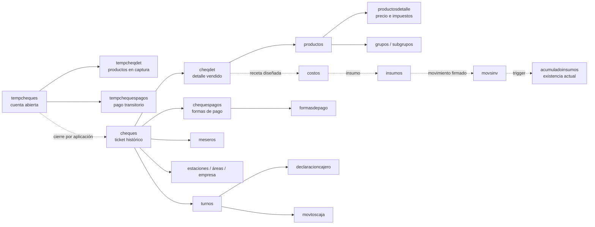

# MAPA FUNCIONAL DE BASE DE DATOS SOFT RESTAURANT

## 1. Alcance y método

Este informe documenta la base `softrestaurant11` restaurada en `CARDONA\SQLEXPRESS`. El respaldo terminó el 24 de agosto de 2026 y contiene operación desde el 5 de febrero hasta el 24 de agosto de 2026.

El análisis fue estrictamente de solo lectura. Se consultaron:

- Catálogos de SQL Server (`sys.tables`, `sys.columns`, claves, índices, dependencias y definiciones).
- Definiciones de las 47 vistas, los 6 procedimientos y los 20 triggers, sin ejecutar procedimientos de negocio.
- Conteos, distribuciones y muestras pequeñas mediante `SELECT`.
- Concordancia entre identificadores compartidos aunque no exista una FK declarada.

No se modificó ningún dato ni objeto.

## 2. Resumen ejecutivo

La base contiene 355 tablas; 125 tienen registros y 230 están vacías. La operación real de este restaurante está concentrada en cuatro conjuntos:

1. **Venta cerrada:** `cheques` → `cheqdet` → `chequespagos`.
2. **Cuenta abierta o transitoria:** `tempcheques` → `tempcheqdet` → `tempchequespagos`.
3. **Catálogo:** `productos` → `productosdetalle` → `grupos`, con subgrupos y comentarios.
4. **Caja:** `turnos` → `declaracioncajero`, `movtoscaja` y pagos de los tickets.

Conclusiones esenciales:

- `cheques.folio` es la clave primaria y el identificador local real de una venta/ticket finalizado.
- `cheqdet.foliodet = cheques.folio` y `chequespagos.folio = cheques.folio`. Estas relaciones no tienen FK, pero en la muestra son completas: no hay detalles ni pagos huérfanos.
- Una venta válida para reportes debe cumplir `pagado = 1`, `cancelado = 0` y `cierre IS NOT NULL`.
- Deben excluirse todas las tablas `temp*` del histórico consolidado. Contienen cuentas abiertas y cuentas pagadas aún en transición.
- En la instantánea hay 24,442 ventas válidas por $6,956,703.50, 519 tickets marcados como cancelados y 6 cuentas temporales.
- Existen 21 tickets con `pagado = 1` y `cancelado = 1`. Conservan importes y pagos, pero no deben contarse como venta válida.
- El catálogo activo usa `productosdetalle.precio`. Las tablas de listas de precios, modificadores formales y promociones formales están vacías.
- Los extras de este negocio son productos normales del grupo `EXTRAS`; los comentarios como “NO CEBOLLA” son instrucciones sin precio.
- El subsistema de inventario existe en el diseño, pero no está operativo en este respaldo: no hay insumos, existencias, movimientos, compras ni proveedores.
- La base guarda existencias actuales en `acumuladoinsumos.existencia` y los triggers de `movsinv` las actualizan. No obstante, ambas tablas están vacías aquí.
- Las 186 FK están habilitadas pero no confiables (`is_not_trusted = 1`). Hay dos inconsistencias heredadas: una en `costos → insumos` y otra en `productosdetalle → udsmedida`.

## 3. Perfil de la instantánea

| Indicador | Resultado |
|---|---:|
| Tickets históricos (`cheques`) | 24,961 |
| Tickets válidos | 24,442 |
| Total almacenado de ventas válidas | $6,956,703.50 |
| Subtotal de ventas válidas | $6,996,247.2778 |
| Descuento de cabecera | $39,775.50 |
| Impuestos almacenados | $463.4464 |
| Propinas | $5,430.00 |
| Cargos | $50.00 |
| Tickets cancelados | 519 |
| Detalles vendidos (`cheqdet`) | 88,287 |
| Filas de pago | 24,787 |
| Turnos | 368 (367 cerrados y 1 abierto) |
| Movimientos de caja | 3,632 |
| Productos | 786 |
| Grupos | 34 |
| Meseros | 10 |
| Usuarios | 9 |
| Estaciones | 5 |

### Formas de pago realmente usadas

| Forma | Tickets | Importe convertido a moneda base | Propina |
|---|---:|---:|---:|
| EFECTIVO | 16,374 | $4,395,899.00 | $2,669.00 |
| VISA | 8,047 | $2,464,016.50 | $2,761.00 |
| DÓLARES | 360 | $102,497.9787 | $0.00 |
| MASTERCARD | 6 | $1,860.00 | $0.00 |

AMEX, crédito, vales, MARC, TokenCash y recompensas existen en el catálogo, pero no tienen pagos históricos en esta copia.

## 4. Mapa funcional general



Las líneas punteadas de inventario representan el diseño previsto, no un flujo operativo comprobado en estos datos.

## 5. Clasificación funcional de tablas

### Ventas y cuentas

- Operativas históricas: `cheques`, `cheqdet`, `chequespagos`.
- Transitorias: `tempcheques`, `tempcheqdet`, `tempchequespagos`, `cuentas`, `detallescuentas`.
- Cancelaciones: `cancela`, `tempcancela`, `motivoscancelacion`, `CancellationReason`.
- Auxiliares: `cheqpedidos`, `cheqerp`, `cuentaspagos`, `xpPasoVentaCabecero`, `xpPasoVentaDetalle`.
- Reporte: `vwrepventascheques`, `vwrepproductosvendidoscheques`, `vwcalculacheques` y sus equivalentes `temp`.

### Pagos

- Principal: `formasdepago`, `chequespagos`, `tempchequespagos`.
- Configuración: `perfilesformasdepago`, `formasdepago_app_area`, `grupoformasdepago`.
- Integraciones no usadas: `MercadoPagoSettings`, `PaymentMethodSRAPP`, `bitacoratarjetacredito`, `bitacoraeasygoband`, `hotelmovtos`.

### Caja y cortes

- `turnos`, `declaracioncajero`, `declaracioncorte`, `movtoscaja`, `movtoscajadetalles`.
- Catálogos: `CashMovementsType`, `ConfigCashMovType`, `denominaciones`.

### Productos y precios

- Principal: `productos`, `productosdetalle`, `grupos`.
- Jerarquía secundaria: `subgrupos`, `grupossubgrupos`, `subgruposproductos`.
- Instrucciones: `comentarios`.
- Precios alternos, vacíos: `listadeprecios`, `listadepreciosdetalle`, `PriceLists`, `ProductPriceLists`, `SalesAreaPriceList`.
- Auditoría de precios: `logcambioprecios`.
- Promoción formal, vacía: `promociones`, `promoproductos`.
- Promoción usada por catálogo: productos normales dentro del grupo `## PROMOCIONES ##`.

### Modificadores y extras

- Modelo formal vacío: `gruposmodificadores`, `modificadores`, `gruposmodificadoresproductos`, `ModifiersPriceLists`.
- Instrucciones sin precio: `comentarios` y `cheqdet.comentario`.
- Extras cobrables reales: productos del grupo `EXTRAS` registrados como líneas normales de `cheqdet`.

### Organización y personal

- `empresas`, `estaciones`, `areasrestaurant`, `areas`, `meseros`, `usuarios`, `usuariosperfiles`.
- Relaciones auxiliares: `estacionesareas`, `estacionesalmacen`.

### Inventario y recetas

- Maestro: `insumos`, `insumosdetalle`, `insumospresentaciones`, `insumospresentacionesdetalle`.
- Receta: `costos`; asignación de receta/almacén: `recetasalmacenes`.
- Movimientos: `movsinv`, `movsinvcancelados`, `movtosalmacen`, `movtosalmacencancelados`.
- Existencia actual: `acumuladoinsumos`.
- Niveles objetivo: `stockinsumos`.
- Ajustes: `invfisicomovtos`, `inventariopendiente`, `traspasosalmacen`.
- Producción: `elaborados`, `insumoselaboracion`.

### Compras y proveedores

- `proveedores`, `ordenescompra`, `ordenescompramov`, `compras`, `comprasmovtos`, `pagosproveedores`.
- Todas están vacías en esta copia.

### Clientes y facturación

- `clientes`, `saldosclientes`, `facturas`, `facturasmovtos`, `foliosfacturados`, `foliosfacturas`.
- CFDI/complementos: `facturas_rep`, `facturas_rep_pagos`, `facturas_rep_doctos`.
- Todas están vacías y ningún ticket está marcado como facturado o asociado a cliente.

### Auditoría, sincronización y tablas técnicas

- Auditoría: `bitacorasistema`, `alertasantifraude`, `notificaciones`, `logcambioprecios`.
- Sincronización: `bitacoraEnvioVentas`, `HistorialActualizaciones`, `nsplatformcontrol`, `WorkspaceControl`, `ws_cloud`.
- Catálogos de plataforma: `Product`, `PaymentMethod`, `Tax`, `TaxRate`, `Currency`, `Country`, `UnitOfMeasure`.
- Estos últimos son capas de plataforma/integración; no sustituyen a `productos`, `formasdepago` ni a las tablas operativas de ventas.

### Históricos o copias secundarias

- `chequesf`, `cheqdetf`, `chequespagosf`, `turnosf` están vacías.
- `cheqdetfeliminados` y `tempcheqdet...` son auxiliares o rastros de eliminación/transición.
- No deben unirse al histórico principal salvo que otra instalación contenga datos y se confirme su semántica.

## 6. Diccionario de tablas críticas

### 6.1 Ventas

| Tabla | Propósito y ejemplo conceptual | Clave y relaciones | Campos relevantes | Confianza |
|---|---|---|---|---|
| `cheques` | Cabecera histórica de un ticket. Un registro representa una cuenta ya trasladada al histórico, pagada o cancelada. | PK `folio`. Enlaces convencionales a detalle/pago por `folio`; a turno por `idturno`; a empresa, área, estación, mesero y usuarios por sus IDs. | Fechas `fecha`, `cierre`, `fechacancelado`; estados `pagado`, `cancelado`, `facturado`; importes `subtotal`, `total`, impuestos, descuentos, propina, cargo, efectivo, tarjeta, vales, otros y cambio. | Alta |
| `tempcheques` | Cuenta activa o en transición. Puede estar abierta, o pagada antes de que la aplicación la mueva al histórico. | PK `folio`, pero su numeración es transitoria. Enlace con tablas `temp*`. | Misma estructura económica que `cheques`, más `cuentaenuso` y `cuentapagadaprocesada`. | Alta |
| `cheqdet` | Una línea del ticket: producto, cantidad, precio y condiciones de captura. | Sin PK declarada. `foliodet → cheques.folio` tiene 100% de concordancia. `idproducto → productos.idproducto` sí tiene FK. La combinación observada `foliodet + movimiento + comanda` no presenta duplicados. | `cantidad`, `precio`, `preciosinimpuestos`, `preciocatalogo`, `descuento`, tasas de impuesto, `hora`, `comentario`, `idmeseroproducto`, `modificador`. | Alta |
| `tempcheqdet` | Líneas de cuentas transitorias. | `foliodet → tempcheques.folio` por convención. | Añade estados de producción y sincronización propios de una cuenta abierta. | Alta |
| `chequespagos` | Una asignación de forma de pago a un ticket. Permite pago mixto. | Sin PK. `folio → cheques.folio` sin huérfanos; FK sólo hacia `formasdepago`. | `importe`, `propina`, `tipodecambio`, `referencia`, `cardBrand`, `idturno_cierre`. | Alta |
| `tempchequespagos` | Pago capturado en una cuenta aún transitoria. | `folio → tempcheques.folio`. | Mismos importes que el pago histórico. | Alta |
| `cancela` | Bitácora de productos cancelados o retirados de una cuenta. Un registro representa cantidad y precio cancelados de un producto. | Sin PK ni FK al ticket. `foliocheque` coincide con tickets históricos sólo en parte; 88 de 498 filas no encuentran cabecera histórica. | `clave`, `cantidad`, `precio`, `razon`, `fecha`, `usuario`, `idturno_cierre`. | Alta para cancelación de línea; media para su enlace histórico |
| `motivoscancelacion` | Catálogo de motivos de cancelación. | PK por código de motivo. | Descripción y bandera de desperdicio. | Alta |

### 6.2 Productos y catálogo

| Tabla | Propósito y ejemplo conceptual | Clave y relaciones | Campos relevantes | Confianza |
|---|---|---|---|---|
| `productos` | Maestro global del artículo vendible. Un registro es un producto como “Hamburguesa” o “Coca-Cola”. | PK `idproducto`; FK `idgrupo → grupos`. | Descripción, PLU, visibilidad por servicio, menú, código SAT, unidad lógica. | Alta |
| `productosdetalle` | Configuración del producto para la empresa: precio, impuestos, bloqueo y operación. | Sin PK declarada; en esta copia existe exactamente una fila por producto. FK a `productos`, `empresas` y unidad. | `precio` con impuestos, `preciosinimpuestos`, tasas, `bloqueado`, `precioabierto`, horarios/precios por día, `idarea`, `idunidad`. | Alta |
| `grupos` | Categoría principal. `clasificacion=1` agrupa bebidas, `2` alimentos y `3` otros. | PK `idgrupo`; referida por `productos`. | Descripción, clasificación, prioridad, colores, alcohol. | Alta |
| `subgrupos` / `grupossubgrupos` / `subgruposproductos` | Jerarquía opcional debajo de grupo. Sólo se usa para Sushi en esta copia. | IDs de grupo, subgrupo y producto. | Descripción y vínculos. | Alta |
| `comentarios` | Instrucciones predefinidas por producto, por ejemplo “NO CEBOLLA”. | FK a producto; `IdComentario` es único, aunque no está declarado como PK. | Texto de instrucción. | Alta |
| `logcambioprecios` | Auditoría de cambios del precio de catálogo. | Sin PK relevante para reportes. | Producto, precio anterior/nuevo, fecha, usuario, empresa y observación. | Alta |
| `listadeprecios*` / `PriceLists*` | Modelos antiguo y nuevo de precios alternos. | FKs a producto y lista. | Precio y precio sin impuesto. | Alta en diseño; no usados aquí |
| `gruposmodificadores*` / `modificadores` | Modelo formal de complementos cobrables. | Producto, grupo modificador y modificador. | Precio, incluidos, máximo y captura forzada. | Alta en diseño; no usado aquí |

`productosdetalle.precioabierto` tiene valores 1 y 2: cinco productos usan 1 y 781 usan 2. La evidencia sugiere que 1 es precio abierto y 2 precio fijo, pero debe confirmarse con la interfaz o documentación del proveedor.

### 6.3 Caja, personal y organización

| Tabla | Propósito y ejemplo conceptual | Clave y relaciones | Campos relevantes | Confianza |
|---|---|---|---|---|
| `turnos` | Apertura y cierre de una caja. Un registro representa un turno de una estación y cajero. | PK `idturnointerno`; `idturno` es el ID operativo usado por tickets, pagos y movimientos. Es único en esta copia. FK a estación. | `apertura`, `cierre`, `fondo`, `cajero`, `efectivo`, `tarjeta`, `vales`, `credito`, `procesado`. | Alta |
| `declaracioncajero` | Importe declarado al corte por forma de pago y moneda. | Sin PK. `idturnointerno → turnos.idturnointerno` tiene 100% de concordancia. | `importedeclarado`, `tipodecambio`, `tipo`, `idformadepago`. | Alta |
| `declaracioncorte` | Conteo por denominación y vouchers. | Sin PK. Enlaza por `idturno`. | Denominación, cantidad, tipo de cambio, importe de voucher/propina. | Alta en diseño; vacía aquí |
| `movtoscaja` | Entradas y salidas ajenas al cobro: compras en efectivo, salvaguardas, propinas o comisiones. | PK `folio`; enlace convencional `idturno → turnos.idturno`; FK a tipo de movimiento. | `tipo` (1 salida, 2 entrada), `importe`, `fecha`, `cancelado`, concepto y referencia. | Alta |
| `formasdepago` | Catálogo de medios de pago. | PK `idformadepago`. | `tipo`: 1 efectivo/moneda, 2 tarjeta, 3 vale, 4 crédito/externo; tipo de cambio, propina, visibilidad y SAT. | Alta |
| `meseros` | Personal que atiende la cuenta o captura productos. | PK `idmeserointerno`; ID operativo `idmesero`. | Nombre, tipo, perfil, empresa, visible. | Alta |
| `usuarios` | Usuarios administrativos/cajeros. | PK `usuario`. | Nombre, perfil, empresa y estado. | Alta |
| `estaciones` | Terminal/caja física o lógica. | PK `idestacion`. | Empresa, área, caja comandero, uso de turno, impresoras, almacén y configuración de pagos. | Alta |
| `areasrestaurant` | Tipo de servicio: `01 COMEDOR`, `02 DOMICILIO`, `03 RAPIDO`. | PK `idarearestaurant`. | Descripción, tipo de servicio y estado. | Alta |
| `empresas` | Sucursal/empresa propietaria de la operación. | PK `idempresa`. | Nombre, razón social y configuración fiscal. | Alta |

### 6.4 Inventario, compras y facturación

| Tabla | Propósito y ejemplo conceptual | Clave y relaciones | Campos relevantes | Confianza |
|---|---|---|---|---|
| `costos` | Receta: cantidad de un insumo consumida por producto. | `idproducto → productos`; `idinsumo → insumos`. | `cantidad`, empresa, WorkspaceId. | Alta en diseño; no utilizable aquí |
| `recetasalmacenes` | Decide de qué almacén sale el insumo de una receta según producto y área. | FKs a producto, área y almacén; `idinsumo` no tiene FK. | Producto, área, almacén, empresa, insumo. | Alta |
| `insumos` | Maestro de ingredientes/insumos. | PK `idinsumo`. | Descripción, unidad, elaboración y rendimiento. | Alta; vacía |
| `insumosdetalle` | Costos y configuración del insumo por empresa. | FK a insumo. | Costo, promedio, impuestos, merma, inventariable, descargar. | Alta; vacía |
| `movsinv` | Libro de movimientos en unidad base. La cantidad se guarda con signo y el trigger la acumula. | Enlaces a concepto, insumo y almacén; `foliocheque` enlazaría la salida por venta. | Fecha, concepto, cantidad, costo, ticket, compra, traspaso, turno y almacén. | Alta; vacía |
| `acumuladoinsumos` | Existencia actual materializada por insumo y almacén. | ID interno y enlaces a insumo/almacén. | `existencia`. | Alta; vacía |
| `stockinsumos` | Mínimo, ideal y máximo; no es la existencia actual. | Insumo, presentación, almacén y empresa. | Niveles objetivo. | Alta; vacía |
| `compras` / `comprasmovtos` | Cabecera y líneas de compras aplicadas. | PK `idcompra`; detalle por `idcompra`, insumo y almacén. | Proveedor, fechas, cancelación, cantidades, costos, descuentos, impuestos y total. | Alta; vacías |
| `ordenescompra` / `ordenescompramov` | Orden previa a la compra. | PK `idordencompra`; líneas por insumo. | Captura, recepción, aplicación, cantidades y costos. | Alta; vacías |
| `clientes` | Maestro de clientes y datos fiscales. | PK `idcliente`. | Contacto, RFC, crédito, descuento, fecha alta y SAT. | Alta; vacía |
| `facturas` / `facturasmovtos` | Cabecera y conceptos de factura. | PK `idfactura`; relación a cliente y empresa. | Fecha, cancelación, subtotal, impuestos, propina, total, CFDI y timbre. | Alta; vacías |
| `foliosfacturados` | Puente entre factura y ticket. | `idfactura` y `folio` por convención. | Porcentaje facturado y turno de cierre. | Alta; vacía |

## 7. FLUJO COMPLETO DE UNA VENTA

### Paso 1: apertura de cuenta

La cuenta nace en `tempcheques`. `fecha` registra la apertura, `mesa` identifica mesa/nombre de servicio, `idmesero` al responsable, `idarearestaurant` el tipo de servicio, `estacion` la terminal e `idturno` el turno activo. Mientras permanece abierta normalmente tiene `pagado=0`, `cierre=NULL` y no tiene pagos.

Hay otra capa `cuentas`/`detallescuentas`, utilizada por interfaces móviles o de integración. Los procedimientos `ValidaDetalles` y `VerificaTurno` leen/escriben esa capa y buscan el turno abierto. No es el histórico contable principal.

### Paso 2: captura de comandas y productos

Cada producto se agrega a `tempcheqdet` con:

- `foliodet`: folio temporal de la cuenta.
- `movimiento`: secuencia de línea dentro de la cuenta.
- `comanda`: agrupación de impresión/cocina cuando se usa.
- `idproducto`, `cantidad`, `precio`, `preciosinimpuestos` y tasas.
- `hora`: fecha/hora exacta de captura de la línea.
- `idmeseroproducto`: mesero que capturó el artículo.
- `comentario`: instrucciones como “NO CEBOLLA”.

### Paso 3: cálculo económico

La cabecera temporal mantiene totales materializados. En la operación observada:

- `subtotal` coincide normalmente con la suma de `cantidad × precio` después de descuento de línea.
- `descuento` es el porcentaje de descuento de cuenta.
- `descuentoimporte` es su importe monetario.
- `totalimpuesto1`, `totalimpuestod1/2/3` guardan impuestos monetarios.
- `total` es el importe central de venta y debe ser la autoridad para venta diaria.
- `propina`, `cargo` y `donativo` se guardan aparte.
- `totalconpropina`, `totalconcargo` y `totalconpropinacargo` son variantes ya calculadas.

### Paso 4: pago

Uno o más registros de `tempchequespagos` asignan el importe a una forma de pago. El importe convertido a moneda base es `importe × tipodecambio`; la propina se guarda separada.

La cabecera mantiene acumulados rápidos (`efectivo`, `tarjeta`, `vales`, `otros`), pero para un reporte flexible la fuente correcta es el detalle de pagos unido a `formasdepago`.

`cambio` es el cambio entregado. En pagos en efectivo el recibido puede inferirse como importe aplicado más cambio; en dólares debe convertir primero el importe. `cashpaymentwith` existe, pero en esta copia está en `-1`, por lo que no es una fuente usable del efectivo recibido.

### Paso 5: cierre y traslado al histórico

Al cerrar/pagar, la aplicación crea la cabecera en `cheques`, las líneas en `cheqdet` y los pagos en `chequespagos`. No existe un trigger o procedimiento local que documente por completo esta copia; la transición está implementada en la aplicación Soft Restaurant.

`cheques.foliotempcheques` conserva el folio temporal de origen en muchos casos, pero no debe usarse como identificador global: los folios temporales se reinician y son de corta vida.

### Paso 6: cancelación

- Cancelación completa: `cheques.cancelado=1`, con motivo, usuario y fecha en la cabecera.
- Cancelación de producto: se registra en `cancela` con producto, cantidad, precio, motivo, usuario y fecha.
- La base conserva importes de tickets cancelados. Por eso todo agregado debe filtrarlos explícitamente.
- No hay líneas negativas en `cheqdet` ni una tabla de devolución de ventas operativa. Los 21 tickets pagados y cancelados pueden representar anulaciones posteriores al pago, pero no hay evidencia suficiente para llamarlos reembolsos.

### Paso 7: turno y corte

`cheques.idturno`, `chequespagos.idturno_cierre` y `movtoscaja.idturno` enlazan con `turnos.idturno`. La concordancia de tickets con turno es completa.

Al cierre:

1. `turnos.cierre` se completa.
2. `declaracioncajero` guarda lo declarado por forma de pago y tipo de cambio.
3. `turnos.efectivo`, `tarjeta`, `vales` y `credito` resumen esa declaración. En la muestra coinciden casi totalmente con las declaraciones.
4. `movtoscaja` aporta salidas y entradas ajenas a la venta, como compras en efectivo y salvaguardas.
5. La diferencia de caja debe comparar declarado contra `fondo + cobros en efectivo + entradas - salidas`. Esta fórmula debe validarse con un corte impreso antes de considerarla definitiva, pues algunas salvaguardas o pagos de propina pueden tener tratamiento especial.

## 8. Identificador, estados y prevención de duplicados

### Identificador recomendado

- Dentro de esta base: `cheques.folio`.
- Para integrar copias de varias sucursales: preferir `cheques.WorkspaceId`, que está informado y es único en los 24,961 tickets; alternativamente usar `idempresa + folio`.
- `numcheque`, `seriefolio` y `foliotempcheques` son claves de negocio o presentación, no la PK técnica segura.

### Regla de venta válida

```sql
WHERE c.pagado = 1
  AND c.cancelado = 0
  AND c.cierre IS NOT NULL
```

### Estados observados

| Estado | Cantidad | Tratamiento |
|---|---:|---|
| Pagado, no cancelado, cerrado | 24,442 | Venta válida |
| No pagado, cancelado, cerrado | 498 | Excluir |
| Pagado y cancelado, cerrado | 21 | Excluir; revisar como anulación posterior |
| Temporal pagado | 4 | No incluir hasta que aparezca en `cheques` |
| Temporal abierto | 2 | Cuenta abierta/incompleta |

### Cómo evitar duplicación

1. Partir siempre de `cheques` filtrado, no de una unión de `cheques` y `tempcheques`.
2. Deduplicar por `folio` o `WorkspaceId` antes de agregar.
3. Agregar pagos por `folio` antes de unirlos con detalles. Unir detalle y pagos directamente produce un producto cartesiano cuando un ticket tiene varios artículos y varias formas de pago.
4. En reportes de productos usar `COUNT(DISTINCT c.folio)` para tickets y sumar líneas sólo desde `cheqdet`.
5. En reportes de venta total sumar `cheques.total` una sola vez por ticket; no sumar `cheqdet.precio` para reproducir la venta contable.
6. Excluir `chequesf`, `temp*`, vistas temporales y bitácoras salvo análisis específico.

## 9. Diccionario de importes

| Campo | Interpretación recomendada | Evidencia/confianza |
|---|---|---|
| `cheques.subtotal` | Importe de productos después de descuentos de línea y antes de ajustes finales de cabecera. | Alta |
| `cheques.subtotalsinimpuestos` | Base sin impuestos. | Alta |
| `cheques.total` | Venta final central sin propina; autoridad para venta. Los pagos coinciden con `total + cargo + donativo`. | Alta |
| `cheques.descuento` | Porcentaje de descuento de cuenta. | Alta |
| `cheques.descuentoimporte` | Importe monetario del descuento de cabecera. | Alta |
| `cheques.totaldescuentos` | Total precomputado de descuentos por clases de producto; útil como control. | Media-alta |
| `cheques.totalimpuesto1`, `totalimpuestod1/2/3` | Importes de impuestos. | Alta |
| `cheques.propina` | Propina total. | Alta |
| `cheques.propinatarjeta` | Parte de propina pagada con tarjeta. | Alta |
| `cheques.cargo` | Cargo adicional separado de la venta central. | Alta |
| `cheques.efectivo/tarjeta/vales/otros` | Acumulados de cabecera por clase de pago. | Alta, pero menos flexible que `chequespagos` |
| `cheques.cambio` | Cambio devuelto. | Alta |
| `chequespagos.importe` | Importe aplicado en la moneda del pago. Convertir con `tipodecambio`. | Alta |
| `chequespagos.propina` | Propina de esa asignación de pago. | Alta |
| `turnos.fondo` | Fondo inicial. | Alta |
| `turnos.efectivo/tarjeta/vales/credito` | Totales declarados/resumidos al corte. | Alta |

## 10. Flujo de inventario

### Modelo diseñado

```text
cheques → cheqdet → productos → costos → insumos
                                      ↓
                           recetasalmacenes
                                      ↓
                       movsinv (SPV: salida por venta)
                                      ↓ trigger
                       acumuladoinsumos.existencia
```

- `costos.cantidad` define cuánto insumo consume una unidad vendida.
- `recetasalmacenes` decide almacén por producto y área.
- `movsinv` almacena entradas/salidas firmadas; `conceptos` identifica el motivo.
- Los triggers `TRG_movsinv_insert/update/delete` actualizan directamente `acumuladoinsumos.existencia`.
- `stockinsumos` sólo guarda mínimos/ideales/máximos.

### Situación real de esta copia

- `insumos`: 0.
- `costos`: 1 receta, para producto `11009` Coca-Cola, con insumo `001001` inexistente.
- `recetasalmacenes`: 3 asignaciones de esa Coca-Cola a Barra para Comedor, Domicilio y Rápido.
- `movsinv`, `acumuladoinsumos`, `stockinsumos`: 0.
- Compras, proveedores, órdenes y traspasos: 0.
- Ningún producto tiene `productos.idinsumospresentaciones` informado.

Conclusión: no es posible producir inventario, costo de receta ni consumo real confiable desde esta copia. El esquema permite hacerlo, pero faltan los maestros y movimientos. La tabla `acumuladoinsumos` sería la existencia actual autoritativa cuando el módulo esté activo; `SUM(movsinv.cantidad)` serviría como auditoría.

## 11. Relaciones implícitas sin FK

| Relación | Evidencia | Resultado |
|---|---|---|
| `cheqdet.foliodet → cheques.folio` | 88,287 filas verificadas | 0 huérfanas |
| `chequespagos.folio → cheques.folio` | 24,787 filas verificadas | 0 huérfanas |
| `cheques.idturno → turnos.idturno` | 24,961 tickets | 0 sin turno |
| `declaracioncajero.idturnointerno → turnos.idturnointerno` | 845 declaraciones | 0 huérfanas |
| `cheques.estacion → estaciones.idestacion` | 24,961 tickets | 100% |
| `cheques.idarearestaurant → areasrestaurant` | 24,961 tickets | 100% |
| `cheques.idempresa → empresas` | 24,961 tickets | 100% |
| `cheques.idmesero → meseros.idmesero` | 12,464 tickets con mesero | Los demás son principalmente venta rápida sin mesero |
| `cancela.foliocheque → cheques.folio` | 498 cancelaciones de línea | 88 sin cabecera histórica; vínculo parcial |
| `recetasalmacenes.idinsumo → insumos.idinsumo` | 3 filas | Insumo maestro ausente |

### Índices y claves con impacto en reportes

- `cheques` tiene PK clustered sobre `folio`, índice por `fecha`, índice por `WorkspaceId` e índice por `foliotempcheques`. Es la tabla mejor preparada para extracción incremental.
- `cheqdet` tiene un índice no clustered sobre `foliodet`; `chequespagos` tiene otro sobre `folio`. Éstos son los caminos correctos de unión hacia la cabecera.
- `productos`, `formasdepago` y `movtoscaja` tienen PK clustered sobre sus identificadores principales.
- `turnos` tiene PK clustered en `idturnointerno`, pero no se observó un índice específico sobre `idturno`, que es el campo usado por tickets y movimientos.
- `tempcheques` tiene PK en `folio`; `tempcheqdet` y `tempchequespagos` no tienen índices propios en esta copia.
- Sólo 152 de las 355 tablas tienen PK. Entre las tablas críticas sin PK están `cheqdet`, `chequespagos`, `productosdetalle` y `declaracioncajero`; por eso sus claves lógicas deben manejarse explícitamente y nunca debe asumirse que una fila es única sin comprobarla.
- Hay 341 índices en total. La presencia de índice no sustituye el filtro de estado ni evita la multiplicación detalle × pago.

## 12. Vistas, procedimientos y triggers relevantes

### Vistas

- `vwrepventascheques`: agrega venta por día, empresa y estado de cancelación usando `cheques.cierre` y `cheques.total`.
- `vwrepproductosvendidoscheques`: une `cheques`, `cheqdet`, `productos` y `empresas`, excluyendo cancelados.
- `vwcalculacheques`: detecta diferencias entre suma de pagos y total, pero no aplica `tipodecambio`; produce falsos positivos para dólares y no debe ser el control principal multimoneda.
- `ProductViewSRX`: confirma que `productosdetalle.preciosinimpuestos` es precio neto y `precio` es precio con impuestos.
- `ShiftViewSRX`: expone `turnos.idturno`, apertura y cierre.

### Procedimientos

- `VerificaTurno`: localiza el turno abierto para la estación/caja comandero.
- `ValidaDetalles`: valida e inserta líneas en `detallescuentas`; pertenece a la capa móvil/intermedia.
- `eventoIntelisis`: declara eventos de abrir turno, cerrar turno y pagar cuenta, pero su cuerpo está vacío.
- `RestoPay_AddResult`: inserta resultados de tarjeta en una bitácora temporal. No tiene registros aquí.
- `Reproceso`: regenera asignaciones de receta/almacén; no debe ejecutarse en análisis.
- `sincronizaBitacora`: mueve filas de sincronización a bitácora; tampoco debe ejecutarse.

### Triggers

- `TRG_movsinv_*`: mantienen existencia actual en `acumuladoinsumos`.
- `Actualizacion*`: registran cambios de catálogo, meseros y turnos para sincronización cloud.
- `SyncCostos`: registra cambios de recetas para sincronización.
- `TR_productosdetalle_insert`: reemplaza la fila previa del producto al insertar; explica por qué conceptualmente existe una fila por producto, aunque no haya PK.
- No hay triggers de ventas que recalculen `cheques`; los totales y el traslado desde `temp*` dependen de la aplicación.

## 13. Ambigüedades y verificaciones pendientes

1. **Devoluciones de venta.** No existe una tabla operativa de devoluciones ni cantidades negativas. Verificar en una terminal qué operación crea Soft Restaurant al devolver una venta pagada y comparar antes/después.
2. **Tickets pagados y cancelados.** Hay 21. Pueden ser anulaciones pospago, pero no se encontró bitácora de reverso bancario. Revisar un ticket impreso y su auditoría.
3. **Precio abierto.** `precioabierto=1` parece abierto y `2` fijo. Confirmar en la pantalla de producto.
4. **Variación de corte.** La fórmula propuesta incorpora fondo, ventas y movimientos, pero salvaguardas y propinas pueden tratarse de forma especial. Comparar con un corte Z real.
5. **`cancela` sin ticket histórico.** Las 88 filas pueden pertenecer a cuentas que nunca cerraron, folios reciclados o purgados. Confirmar contra bitácora del sistema.
6. **Inventario.** El modelo está incompleto y la única receta es huérfana. Se necesita otro respaldo donde el módulo de inventario esté activo para validar consumo por venta.
7. **FK no confiables.** No se deben activar/revalidar en esta copia sin una investigación separada; podrían fallar por los datos heredados.

## 14. CONSULTAS RECOMENDADAS

Todas las consultas siguientes son `SELECT`. Usan un rango semiabierto: `@Desde` incluido y el día posterior a `@Hasta` excluido.

### Base común de ventas válidas

```sql
WITH VentasValidas AS (
    SELECT c.*
    FROM dbo.cheques AS c
    WHERE c.pagado = 1
      AND c.cancelado = 0
      AND c.cierre IS NOT NULL
)
SELECT *
FROM VentasValidas;
```

### Venta total por día

```sql
SELECT
    CAST(c.cierre AS date) AS fecha,
    COUNT_BIG(*) AS tickets,
    SUM(c.subtotal) AS subtotal,
    SUM(c.descuentoimporte) AS descuentos,
    SUM(c.totalimpuesto1 + c.totalimpuestod1
        + c.totalimpuestod2 + c.totalimpuestod3) AS impuestos,
    SUM(c.total) AS venta,
    SUM(c.propina) AS propinas,
    SUM(c.cargo) AS cargos
FROM dbo.cheques AS c
WHERE c.pagado = 1 AND c.cancelado = 0 AND c.cierre IS NOT NULL
GROUP BY CAST(c.cierre AS date)
ORDER BY fecha;
```

### Venta por rango de fechas

```sql
SELECT COUNT_BIG(*) AS tickets, SUM(c.total) AS venta
FROM dbo.cheques AS c
WHERE c.pagado = 1 AND c.cancelado = 0 AND c.cierre IS NOT NULL
  AND c.cierre >= @Desde
  AND c.cierre < DATEADD(day, 1, @Hasta);
```

### Venta por producto

```sql
SELECT
    d.idproducto,
    p.descripcion,
    SUM(d.cantidad) AS cantidad,
    SUM(d.cantidad * d.precio) AS importe_bruto,
    SUM(d.cantidad * d.precio
        * (1 - ISNULL(d.descuento, 0) / 100.0)
        * (1 - ISNULL(c.descuento, 0) / 100.0)) AS importe_neto_estimado,
    COUNT(DISTINCT c.folio) AS tickets
FROM dbo.cheques AS c
JOIN dbo.cheqdet AS d ON d.foliodet = c.folio
JOIN dbo.productos AS p ON p.idproducto = d.idproducto
WHERE c.pagado = 1 AND c.cancelado = 0 AND c.cierre IS NOT NULL
  AND c.cierre >= @Desde AND c.cierre < DATEADD(day, 1, @Hasta)
GROUP BY d.idproducto, p.descripcion
ORDER BY importe_bruto DESC;
```

El neto por producto es una asignación estimada. La venta contable total debe salir de `cheques.total`.

### Venta por categoría

```sql
SELECT
    g.idgrupo,
    g.descripcion AS categoria,
    g.clasificacion,
    SUM(d.cantidad) AS cantidad,
    SUM(d.cantidad * d.precio) AS importe_bruto
FROM dbo.cheques AS c
JOIN dbo.cheqdet AS d ON d.foliodet = c.folio
JOIN dbo.productos AS p ON p.idproducto = d.idproducto
JOIN dbo.grupos AS g ON g.idgrupo = p.idgrupo
WHERE c.pagado = 1 AND c.cancelado = 0 AND c.cierre IS NOT NULL
  AND c.cierre >= @Desde AND c.cierre < DATEADD(day, 1, @Hasta)
GROUP BY g.idgrupo, g.descripcion, g.clasificacion
ORDER BY importe_bruto DESC;
```

### Número de tickets y ticket promedio

```sql
SELECT
    COUNT_BIG(*) AS tickets,
    SUM(c.total) AS venta,
    AVG(CAST(c.total AS decimal(19,4))) AS ticket_promedio
FROM dbo.cheques AS c
WHERE c.pagado = 1 AND c.cancelado = 0 AND c.cierre IS NOT NULL
  AND c.cierre >= @Desde AND c.cierre < DATEADD(day, 1, @Hasta);
```

### Ventas por hora

```sql
SELECT
    DATEPART(hour, c.cierre) AS hora,
    COUNT_BIG(*) AS tickets,
    SUM(c.total) AS venta
FROM dbo.cheques AS c
WHERE c.pagado = 1 AND c.cancelado = 0 AND c.cierre IS NOT NULL
  AND c.cierre >= @Desde AND c.cierre < DATEADD(day, 1, @Hasta)
GROUP BY DATEPART(hour, c.cierre)
ORDER BY hora;
```

### Ventas por mesero y usuario de cobro

```sql
SELECT
    c.idmesero,
    m.nombre AS mesero,
    c.usuariopago,
    COUNT_BIG(*) AS tickets,
    SUM(c.total) AS venta
FROM dbo.cheques AS c
LEFT JOIN dbo.meseros AS m
  ON m.idmesero = c.idmesero AND m.idempresa = c.idempresa
WHERE c.pagado = 1 AND c.cancelado = 0 AND c.cierre IS NOT NULL
  AND c.cierre >= @Desde AND c.cierre < DATEADD(day, 1, @Hasta)
GROUP BY c.idmesero, m.nombre, c.usuariopago
ORDER BY venta DESC;
```

### Ventas por forma de pago

```sql
SELECT
    fp.idformadepago,
    fp.descripcion,
    fp.tipo,
    COUNT_BIG(*) AS filas_pago,
    COUNT(DISTINCT c.folio) AS tickets,
    SUM(cp.importe * ISNULL(cp.tipodecambio, 1)) AS importe_base,
    SUM(cp.propina * ISNULL(cp.tipodecambio, 1)) AS propina_base
FROM dbo.cheques AS c
JOIN dbo.chequespagos AS cp ON cp.folio = c.folio
JOIN dbo.formasdepago AS fp ON fp.idformadepago = cp.idformadepago
WHERE c.pagado = 1 AND c.cancelado = 0 AND c.cierre IS NOT NULL
  AND c.cierre >= @Desde AND c.cierre < DATEADD(day, 1, @Hasta)
GROUP BY fp.idformadepago, fp.descripcion, fp.tipo
ORDER BY importe_base DESC;
```

### Cancelaciones completas y de productos

```sql
SELECT c.folio, c.numcheque, c.fecha, c.cierre, c.fechacancelado,
       c.idturno, c.usuariocancelo, c.razoncancelado, c.idmotivocancela,
       c.pagado, c.total
FROM dbo.cheques AS c
WHERE c.cancelado = 1
  AND COALESCE(c.fechacancelado, c.cierre) >= @Desde
  AND COALESCE(c.fechacancelado, c.cierre) < DATEADD(day, 1, @Hasta)
ORDER BY COALESCE(c.fechacancelado, c.cierre);

SELECT ca.foliocheque, ca.fecha, ca.usuario, ca.clave AS idproducto,
       p.descripcion, ca.cantidad, ca.precio, ca.razon
FROM dbo.cancela AS ca
LEFT JOIN dbo.productos AS p ON p.idproducto = ca.clave
WHERE ca.fecha >= @Desde AND ca.fecha < DATEADD(day, 1, @Hasta)
ORDER BY ca.fecha;
```

### Descuentos

```sql
SELECT
    CAST(c.cierre AS date) AS fecha,
    COUNT_BIG(*) AS tickets_con_descuento,
    SUM(c.descuentoimporte) AS descuento_cabecera,
    SUM(c.totaldescuentos) AS descuentos_precalculados,
    SUM(c.totalcortesias) AS cortesias
FROM dbo.cheques AS c
WHERE c.pagado = 1 AND c.cancelado = 0 AND c.cierre IS NOT NULL
  AND (ISNULL(c.descuentoimporte,0) <> 0
       OR ISNULL(c.totaldescuentos,0) <> 0
       OR ISNULL(c.totalcortesias,0) <> 0)
GROUP BY CAST(c.cierre AS date)
ORDER BY fecha;
```

### Cortes de caja y diferencia candidata

```sql
WITH PagosTurno AS (
    SELECT c.idturno,
           SUM(CASE WHEN fp.tipo = 1
                    THEN cp.importe * ISNULL(cp.tipodecambio,1) ELSE 0 END) AS efectivo_sistema,
           SUM(CASE WHEN fp.tipo = 2
                    THEN cp.importe * ISNULL(cp.tipodecambio,1) ELSE 0 END) AS tarjeta_sistema
    FROM dbo.cheques AS c
    JOIN dbo.chequespagos AS cp ON cp.folio = c.folio
    JOIN dbo.formasdepago AS fp ON fp.idformadepago = cp.idformadepago
    WHERE c.pagado = 1 AND c.cancelado = 0 AND c.cierre IS NOT NULL
    GROUP BY c.idturno
), Movimientos AS (
    SELECT idturno,
           SUM(CASE WHEN cancelado = 0 AND tipo = 1 THEN importe ELSE 0 END) AS salidas,
           SUM(CASE WHEN cancelado = 0 AND tipo = 2 THEN importe ELSE 0 END) AS entradas
    FROM dbo.movtoscaja
    GROUP BY idturno
)
SELECT t.idturnointerno, t.idturno, t.apertura, t.cierre,
       t.idestacion, t.cajero, t.fondo,
       p.efectivo_sistema, p.tarjeta_sistema,
       t.efectivo AS efectivo_declarado,
       t.tarjeta AS tarjeta_declarada,
       m.entradas, m.salidas,
       t.efectivo - (ISNULL(t.fondo,0) + ISNULL(p.efectivo_sistema,0)
                     + ISNULL(m.entradas,0) - ISNULL(m.salidas,0)) AS diferencia_candidata
FROM dbo.turnos AS t
LEFT JOIN PagosTurno AS p ON p.idturno = t.idturno
LEFT JOIN Movimientos AS m ON m.idturno = t.idturno
WHERE t.apertura >= @Desde AND t.apertura < DATEADD(day, 1, @Hasta)
ORDER BY t.apertura;
```

### Inventario actual y movimientos

```sql
SELECT ai.idinsumo, i.descripcion, ai.idalmacen, a.nombre AS almacen,
       ai.existencia
FROM dbo.acumuladoinsumos AS ai
JOIN dbo.insumos AS i ON i.idinsumo = ai.idinsumo
JOIN dbo.almacen AS a ON a.idalmacen = ai.idalmacen
ORDER BY a.nombre, i.descripcion;

SELECT m.fecha, m.foliocheque, m.idturno, m.idconcepto,
       co.descripcion AS concepto, co.tipo, m.idinsumo,
       i.descripcion AS insumo, m.idalmacen, m.cantidad, m.costo
FROM dbo.movsinv AS m
LEFT JOIN dbo.conceptos AS co ON co.idconcepto = m.idconcepto
LEFT JOIN dbo.insumos AS i ON i.idinsumo = m.idinsumo
WHERE m.fecha >= @Desde AND m.fecha < DATEADD(day, 1, @Hasta)
ORDER BY m.fecha;
```

### Cobertura de receta por producto vendido

```sql
SELECT
    COUNT_BIG(*) AS lineas_vendidas,
    SUM(CASE WHEN co.idproducto IS NOT NULL THEN 1 ELSE 0 END) AS lineas_con_receta,
    SUM(CASE WHEN i.idinsumo IS NOT NULL THEN 1 ELSE 0 END) AS lineas_con_insumo_valido
FROM dbo.cheques AS c
JOIN dbo.cheqdet AS d ON d.foliodet = c.folio
LEFT JOIN dbo.costos AS co ON co.idproducto = d.idproducto
LEFT JOIN dbo.insumos AS i ON i.idinsumo = co.idinsumo
WHERE c.pagado = 1 AND c.cancelado = 0 AND c.cierre IS NOT NULL;
```

## 15. Tablas críticas para un futuro sistema de reportes

Lista mínima:

1. `cheques` — autoridad de ticket, estado, fecha y totales.
2. `cheqdet` — productos, cantidades y precios vendidos.
3. `chequespagos` — desglose de medios de pago.
4. `formasdepago` — clasificación del pago.
5. `productos` — catálogo y grupo.
6. `productosdetalle` — precio actual, impuestos y estado.
7. `grupos` — categoría y clasificación alimento/bebida/otro.
8. `turnos` — apertura, cierre y resumen de caja.
9. `declaracioncajero` — declaración detallada del corte.
10. `movtoscaja` — entradas y salidas no originadas por venta.
11. `meseros` y `usuarios` — atribución por empleado/cajero.
12. `estaciones`, `areasrestaurant` y `empresas` — caja, servicio y sucursal.
13. `cancela` y `motivoscancelacion` — cancelaciones de producto.
14. `costos`, `insumos`, `movsinv` y `acumuladoinsumos` — inventario, sólo cuando exista información válida.

Para el primer sistema de reportes de ventas, la extracción debe comenzar únicamente con `cheques`, `cheqdet`, `chequespagos`, `formasdepago`, `productos`, `productosdetalle`, `grupos`, `turnos`, `meseros`, `usuarios`, `estaciones`, `areasrestaurant` y `empresas`.
