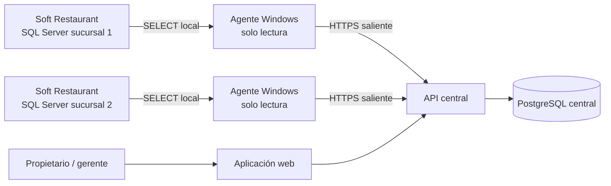

# PLAN DE DESARROLLO — SISTEMA WEB DE REPORTES SOFT RESTAURANT

## 1. Objetivo

Construir un sistema que permita instalar un componente pequeño en cada negocio que usa Soft Restaurant y consultar desde una aplicación web central:

- Venta del día y acumulado en tiempo casi real.
- Tickets, ticket promedio y venta por hora.
- Ventas por producto, grupo, mesero, cajero y forma de pago.
- Cortes actuales y anteriores.
- Tickets y productos cancelados.
- Entradas y salidas de caja.
- Estado de sincronización de cada sucursal.
- Inventario posteriormente, sólo en sucursales donde los insumos y movimientos estén realmente configurados.

El sistema será exclusivamente de lectura respecto a Soft Restaurant. Nunca escribirá ni corregirá información en su base.

## 2. Decisión principal de arquitectura

No se debe exponer SQL Server de las sucursales a Internet ni hacer que el navegador consulte directamente la base local.

Cada sucursal tendrá un **Agente de Sincronización** instalado como servicio de Windows. El agente leerá únicamente las tablas autorizadas y enviará los datos necesarios por HTTPS a un servidor central. La aplicación web consultará la base central.

Ventajas:

- No se abren puertos entrantes en el negocio.
- La aplicación continúa capturando cuando Internet falla y envía al regresar.
- La web no depende de que SQL Server acepte conexiones remotas.
- Se puede consolidar una, varias o todas las sucursales.
- La fuente Soft Restaurant permanece intacta.

## 3. Dónde instalar el agente

Debe existir **un solo agente por base de datos/sucursal**, instalado en un equipo Windows que:

- Permanezca encendido durante la operación.
- Pueda conectarse al SQL Server de Soft Restaurant.
- Tenga salida HTTPS a Internet.

Si cinco cajas comparten la misma base SQL, no se instala en las cinco: se instala una vez en el servidor o equipo principal. Instalar varios agentes contra la misma base complicaría la operación, aunque el servidor central pueda rechazar duplicados.

Si cada negocio tiene una base independiente, cada negocio lleva su propio agente y código de sucursal.

## 4. Componentes propuestos

### 4.1 Agente local para Windows

Recomendación: **.NET 8 Worker Service** ejecutado como servicio de Windows.

Responsabilidades:

- Detectar/probar la instancia SQL configurada.
- Ejecutar únicamente consultas `SELECT` previamente incluidas en el programa.
- Transformar los datos al contrato central.
- Guardar una cola local en SQLite cuando no haya Internet.
- Reintentar sin duplicar.
- Enviar telemetría: última sincronización, retraso y errores sin secretos.
- Actualizarse de forma controlada en versiones posteriores.

El instalador será un `.exe` o `.msi` con asistente para:

1. Elegir la instancia, por ejemplo `SERVIDOR\SQLEXPRESS`.
2. Elegir `restaurant11`.
3. Introducir el código de activación generado en la web.
4. Probar conexión y permisos de lectura.
5. Instalar e iniciar el servicio.
6. Confirmar que la sucursal aparece en línea.

### 4.2 API central

Recomendación: **NestJS + TypeScript**.

Responsabilidades:

- Activación y autenticación de agentes.
- Recepción idempotente de lotes.
- Validación del contrato y rechazo de datos incompletos.
- Consultas de dashboard y reportes.
- Usuarios, sucursales y permisos.
- Auditoría de cada sincronización.

### 4.3 Base central

Recomendación: **PostgreSQL + Prisma**.

La base central será un modelo de lectura consolidado; no intentará copiar las 355 tablas completas.

### 4.4 Aplicación web

Recomendación: **React + TypeScript** con diseño adaptable a escritorio y móvil.

Pantallas iniciales:

- Resumen de hoy.
- Comparación de sucursales.
- Ventas y tickets.
- Productos y categorías.
- Formas de pago.
- Cancelaciones.
- Cortes y movimientos de caja.
- Estado de agentes/sincronización.

### 4.5 Despliegue central

Puede alojarse en un VPS Ubuntu mediante contenedores:

- API.
- Web.
- PostgreSQL.
- Proxy HTTPS.
- Respaldos automáticos.

## 5. Fuente exacta de cada indicador

| Indicador | Fuente Soft Restaurant | Regla |
|---|---|---|
| Venta de hoy | `cheques` | `pagado=1 AND cancelado=0 AND cierre IS NOT NULL`; sumar `total` por fecha local de `cierre` |
| Tickets | `cheques` | Contar `folio` una vez |
| Ticket promedio | `cheques` | `SUM(total) / COUNT(folio)` |
| Venta por producto | `cheques + cheqdet + productos` | Detalles sólo de tickets válidos |
| Venta por grupo | Añadir `grupos` | `productos.idgrupo → grupos.idgrupo` |
| Venta por forma de pago | `chequespagos + formasdepago` | `importe × tipodecambio`; excluir tickets cancelados |
| Propinas | `cheques.propina` o `chequespagos.propina` | Mostrar aparte de venta |
| Productos cancelados | `cancela + productos` | Agrupar cantidad e importe por fecha/producto |
| Tickets cancelados | `cheques` | `cancelado=1`, aunque `pagado=1` |
| Cortes | `turnos` | `idturno`, apertura, cierre, cajero y totales declarados |
| Declaración de corte | `declaracioncajero` | Unir por `idturnointerno` |
| Salidas de caja | `movtoscaja` | `tipo=1 AND cancelado=0` |
| Entradas de caja | `movtoscaja` | `tipo=2 AND cancelado=0` |
| Caja/terminal | `estaciones` | `cheques.estacion → estaciones.idestacion` |
| Mesero | `meseros` | `cheques.idmesero`; puede estar vacío en venta rápida |
| Cajero de cobro | `cheques.usuariopago` | Unir a `usuarios.usuario` |
| Inventario actual | `acumuladoinsumos` | Sólo si el módulo tiene datos válidos |
| Movimientos de inventario | `movsinv + conceptos` | Cantidad firmada por insumo/almacén |

## 6. Modelo central mínimo

### Organización

- `organizations`: propietario o grupo de negocios.
- `branches`: sucursal, zona horaria, moneda y estado.
- `agents`: instalación, versión, último contacto y token revocable.
- `users`, `roles`, `user_branches`: acceso a una o varias sucursales.

### Datos sincronizados

- `sales`: cabecera del ticket.
- `sale_lines`: productos del ticket.
- `sale_payments`: medios de pago.
- `products`: catálogo por sucursal.
- `product_groups`: categorías.
- `payment_methods`: formas de pago.
- `shifts`: turnos/cortes.
- `cash_declarations`: declaración por forma de pago.
- `cash_movements`: entradas y salidas.
- `cancellation_summaries`: cancelaciones de producto agregadas.
- `waiters`, `cashiers`, `stations`, `service_areas`.
- `sync_runs`, `sync_cursors`, `ingestion_errors`.

### Llaves idempotentes

La copia analizada confirma que `WorkspaceId` es único y no nulo en:

- Los 24,961 tickets.
- Las 88,287 líneas.
- Los 24,787 pagos.
- Los 368 turnos.
- Los 786 productos.

Por eso las restricciones centrales recomendadas son:

- Venta: `UNIQUE(branch_id, source_workspace_id)`.
- Línea: `UNIQUE(branch_id, source_workspace_id)`.
- Pago: `UNIQUE(branch_id, source_workspace_id)`.
- Turno: `UNIQUE(branch_id, source_workspace_id)`.
- Producto: `UNIQUE(branch_id, source_workspace_id)`.

Además se conservarán `source_folio`, `source_idturno`, `source_idproducto` y `source_idempresa` para auditoría.

`productosdetalle` no tiene `WorkspaceId`; su llave será `branch_id + idproducto + idempresa`.

`cancela` no tiene PK y contiene filas idénticas que pueden ser legítimas. No se inventará una llave. El agente enviará una instantánea agregada por sucursal, fecha, ticket, producto, usuario, motivo, precio y número de ocurrencias; el servidor reemplazará solamente la partición de fechas recibida.

## 7. Estrategia de sincronización

SQL Server no tiene CDC ni Change Tracking habilitados. La solución debe detectar altas y modificaciones con lecturas periódicas.

### Ciclo rápido — cada 60 segundos

- Nuevos tickets cuyo `folio` sea mayor al cursor conocido.
- Detalles y pagos de esos tickets.
- Turno abierto y últimos turnos modificables.
- Nuevos movimientos de caja por `movtoscaja.folio`.
- Estado de salud del agente.

### Revisión reciente — cada 5 minutos

- Volver a leer tickets de los últimos 3 días.
- Detectar cambios en `cancelado`, `pagado`, `cierre`, totales y usuario.
- Actualizar turnos abiertos y recién cerrados.
- Reemplazar cancelaciones de los últimos 3 días.

### Reconciliación nocturna

- Leer cabeceras históricas completas, que en esta base son sólo unas 25 mil filas.
- Comparar una huella de campos críticos por `WorkspaceId`.
- Releer detalle/pagos únicamente si cambió la cabecera o faltan hijos.
- Reconciliar turnos, declaraciones y movimientos de los últimos 90 días.
- Actualizar catálogo completo; 786 productos es un volumen pequeño.

### Reconciliación semanal

- Conteos por día, totales, cancelados y máximo folio contra origen.
- Alerta automática si la sucursal central difiere de Soft Restaurant.

### Cuentas temporales

`tempcheques`, `tempcheqdet` y `tempchequespagos` no se incorporarán a la venta del día. En una fase posterior podrán mostrarse en un panel separado como “cuentas abiertas”, claramente diferenciadas.

## 8. Contrato de venta central

Cada venta enviada debe incluir al menos:

- Identidad: `WorkspaceId`, `folio`, `numcheque`, empresa y sucursal.
- Tiempo: apertura `fecha`, cierre `cierre`, cancelación si existe.
- Estado: pagado, cancelado, facturado.
- Operación: turno, estación, área, tipo de servicio, mesa, mesero, usuario de pago.
- Importes: subtotal, descuento, impuestos, total, cargo, donativo, propina y cambio.
- Líneas: producto, cantidad, precio, descuento, impuestos, hora y comentario.
- Pagos: forma, importe, tipo de cambio, propina y marca general de tarjeta.

No se enviarán números de tarjeta, referencias bancarias, contraseñas, RFC de clientes ni datos personales que no sean necesarios para el reporte.

## 9. Seguridad

### Acceso local a SQL Server

Crear durante la instalación, con autorización explícita, una identidad exclusiva para el agente:

- Permiso `CONNECT`.
- `SELECT` únicamente en las tablas requeridas.
- Sin permisos de `INSERT`, `UPDATE`, `DELETE`, `EXECUTE`, `ALTER`, `CONTROL` ni administración.
- Secreto aleatorio almacenado con DPAPI de Windows.
- Lista de consultas fija; el servidor central nunca enviará SQL para ejecutar.

La creación del usuario de lectura será un paso de seguridad separado y auditable. No cambia datos comerciales, pero sí permisos de SQL, por lo que debe revisarse y aprobarse antes del despliegue.

### Comunicación

- Sólo HTTPS saliente por puerto 443.
- Token distinto por agente y sucursal.
- Rotación y revocación desde la web.
- Firma del cuerpo y protección contra repetición.
- Lotes comprimidos y límites de tamaño.

### Aplicación web

- Roles: propietario, gerente, auditor y consulta.
- Un usuario sólo ve las sucursales asignadas.
- Registro de inicios de sesión, exportaciones y cambios de configuración.
- Autenticación multifactor para propietarios.

## 10. Manejo de Internet caído y reinicios

- SQLite local guarda lotes pendientes y cursores.
- Cada lote tiene identificador único.
- El servidor responde qué registros aceptó.
- El agente borra de su cola sólo después de confirmación.
- Los `upsert` centrales usan las llaves `WorkspaceId`, por lo que reenviar es seguro.
- Al reiniciar el equipo, el servicio continúa desde su último cursor.
- Debe soportar al menos 7 días sin Internet sin perder información.

## 11. Dashboard del MVP

### Encabezado

- Sucursal seleccionada o “Todas”.
- Fecha de negocio y zona horaria.
- Última sincronización y retraso.
- Turno abierto/cerrado.

### Tarjetas principales

- Venta de hoy.
- Tickets de hoy.
- Ticket promedio.
- Efectivo.
- Tarjetas.
- Propinas.
- Cancelaciones completas.
- Importe de productos cancelados.
- Salidas de caja.

### Gráficas y tablas

- Venta acumulada por hora.
- Comparación con ayer y mismo día de semana anterior.
- Productos más vendidos.
- Venta por grupo alimento/bebida/otro.
- Venta por mesero y cajero.
- Formas de pago.
- Últimos tickets cancelados.
- Últimas salidas de caja.
- Cortes anteriores con diferencia candidata.

### Drill-down

Desde cualquier total se podrá abrir:

- Lista de tickets que lo forman.
- Detalle de productos.
- Pagos del ticket.
- Estado, estación, turno, mesero y cajero.
- Motivo y usuario de cancelación cuando corresponda.

## 12. API inicial

### Agentes

- `POST /agents/activate`
- `POST /agents/heartbeat`
- `POST /ingestion/sales`
- `POST /ingestion/catalog`
- `POST /ingestion/shifts`
- `POST /ingestion/cash-movements`
- `POST /ingestion/cancellations-snapshot`
- `POST /ingestion/reconciliation`

### Aplicación web

- `GET /dashboard/today`
- `GET /reports/sales`
- `GET /reports/products`
- `GET /reports/payments`
- `GET /reports/cancellations`
- `GET /reports/shifts`
- `GET /reports/cash-movements`
- `GET /sales/:id`
- `GET /branches/:id/sync-status`

## 13. Fases de desarrollo

### Fase 0 — decisiones y preparación

Entregables:

- Lista de sucursales, computadoras servidoras e instancias SQL.
- Definición de quién puede ver cada negocio.
- Servidor central elegido.
- Política de retención y respaldo.

Criterio de salida: se conoce dónde vive cada base y hay una computadora designada por sucursal.

### Fase 1 — contrato y extractor de solo lectura

Construir contra esta copia restaurada:

- Consultas versionadas de tickets, detalle, pagos, turnos, movimientos y cancelaciones.
- Contrato JSON normalizado.
- Prueba de llaves y reenvío idempotente.
- Comparador diario contra los totales de Soft Restaurant.

Criterio de salida: la extracción reproduce venta, tickets, pagos y cancelados sin duplicar.

### Fase 2 — API y base central

- Modelo PostgreSQL.
- Ingesta idempotente.
- Activación de agentes.
- Reconciliación y auditoría.
- Usuarios, sucursales y roles básicos.

Criterio de salida: reenviar el mismo lote no cambia conteos ni duplica registros.

### Fase 3 — agente e instalador Windows

- Servicio Windows.
- Cola offline.
- Asistente de instalación.
- Diagnóstico de conexión.
- Logs locales rotativos.
- Desinstalación segura sin tocar Soft Restaurant.

Criterio de salida: un usuario puede instalarlo, desconectar Internet, operar, reconectar y recuperar todo.

### Fase 4 — dashboard web MVP

- Resumen de hoy.
- Ventas, productos, pagos, cancelaciones, cortes y salidas.
- Filtros por sucursal y rango.
- Exportación CSV/PDF después de validar los totales.

Criterio de salida: cada tarjeta permite rastrear los tickets que forman el total.

### Fase 5 — validación contable/operativa

Para al menos 7 días:

- Comparar venta diaria contra reporte oficial de Soft Restaurant.
- Comparar efectivo, tarjeta y dólares.
- Revisar 10 tickets manualmente.
- Revisar tickets pagados/cancelados.
- Comparar dos cortes y sus movimientos de caja.
- Reiniciar agente y repetir sincronización.

Criterio de salida: diferencias explicadas y tolerancia monetaria máxima de $0.01 por ticket, salvo redondeos documentados de divisa.

### Fase 6 — piloto en una sucursal

- Instalar sólo en un negocio.
- Operar en paralelo sin sustituir reportes oficiales.
- Medir carga de SQL, ancho de banda, retraso y estabilidad.
- Corregir instalador y monitoreo.

Criterio de salida: 14 días sin pérdida ni duplicación y con conciliación diaria aprobada.

### Fase 7 — despliegue gradual

- Segunda sucursal.
- Comparación consolidada.
- Después, resto de negocios uno por uno.
- Inventario sólo en bases donde la auditoría encuentre insumos y movimientos válidos.

## 14. Pruebas obligatorias

### Datos

- Ticket válido, cancelado, pagado/cancelado y abierto.
- Pago en efectivo, tarjeta, dólares y pago mixto.
- Cambio, propina, cargo y descuento.
- Producto cancelado repetido.
- Ticket sin mesero de venta rápida.
- Corte abierto y cerrado.
- Entrada y salida de caja.

### Idempotencia

- Enviar un lote dos veces.
- Reiniciar durante el envío.
- Borrar sólo la copia central de prueba y resincronizar.
- Dos agentes intentando activar la misma sucursal.

### Resiliencia

- Sin Internet por 1 hora, 1 día y 7 días.
- SQL Server detenido temporalmente.
- Contraseña de lectura revocada.
- Disco local casi lleno.

### Seguridad

- Confirmar que el usuario SQL no puede modificar datos.
- Confirmar que la API rechaza otra sucursal.
- Confirmar que no viajan contraseñas ni referencias sensibles.
- Escaneo del instalador y firma digital antes del despliegue general.

## 15. Monitoreo operativo

La web debe mostrar por sucursal:

- En línea / retrasada / desconectada.
- Hora del último ticket recibido.
- Hora del último contacto.
- Registros pendientes en cola.
- Último error sanitizado.
- Versión del agente.
- Resultado de la última conciliación.

Alertas recomendadas:

- Sin contacto durante 10 minutos en horario de operación.
- Cola mayor a un umbral.
- Diferencia entre conteo/totales local y central.
- Cambio de instancia o base configurada.
- Agente desactualizado.

## 16. Lo que queda fuera del MVP

- Escribir pedidos o pagos en Soft Restaurant.
- Modificar catálogo, precios, usuarios o recetas.
- Inventario cuando la sucursal no tenga insumos/movimientos válidos.
- Facturación y clientes, porque están vacíos en esta copia.
- Sustituir el corte oficial antes de validar la fórmula con cortes impresos.
- Exponer SQL Server por Internet.

## 17. Calendario orientativo

Para un desarrollador con dedicación principal:

| Etapa | Duración orientativa |
|---|---:|
| Contrato y extractor | 1 semana |
| API y modelo central | 1–2 semanas |
| Agente e instalador | 1–2 semanas |
| Dashboard MVP | 1–2 semanas |
| Validación y piloto | 2 semanas |

MVP técnico: aproximadamente 4–6 semanas. Versión lista para varias sucursales después del piloto: aproximadamente 7–9 semanas. El tiempo depende de acceso a una instalación real, cortes oficiales y disponibilidad del servidor central.

## 18. Primer entregable recomendado

Antes de diseñar todas las pantallas, construir un **piloto vertical** que haga solamente esto:

1. Leer tickets válidos, detalle, pagos, turnos, cancelaciones y movimientos de caja de la copia restaurada.
2. Enviarlos a PostgreSQL usando llaves idempotentes.
3. Mostrar una página con venta de hoy, tickets, formas de pago, cancelaciones y salidas.
4. Repetir la sincronización y demostrar que los conteos no cambian.
5. Comparar un día completo contra Soft Restaurant.

Si ese piloto concilia, la arquitectura queda demostrada y el resto del dashboard se construye sobre una fuente confiable.
